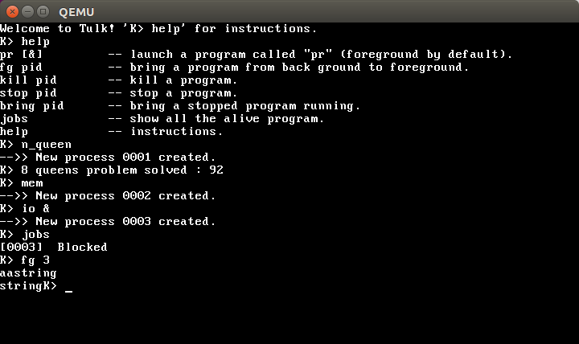

## 介绍

**TULK** is a hand-crafted `Toy` `Unix` `Like` `Kernel`.

## 功能

- [x] Grub引导
- [x] 显示字符
- [x] 键盘读入字符
- [x] 相关库函数
- [x] 全局描述符表
- [x] 虚拟内存管理
- [x] 异常和中断
- [x] 定时器
- [x] 创建内核线程
- [x] 系统调用
- [x] 多线程
- [x] 线程控制与管理

### 运行

```
$ sudo ln -s /usr/bin/qemu-system-i386 /usr/bin/qemu
$ cd ./tulk
$ make
$ make qemu
``` 




### 参考

- [JamesM’s kernel development tutorials](http://www.jamesmolloy.co.uk/tutorial_html/)


